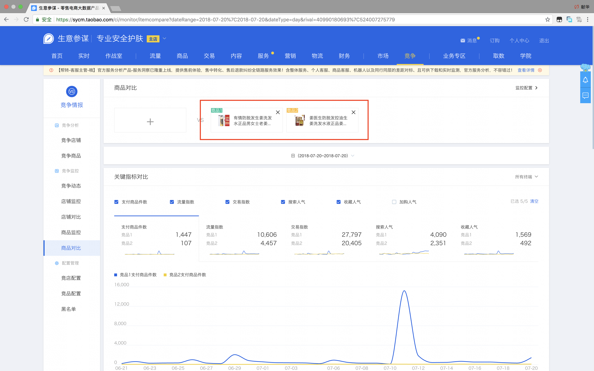
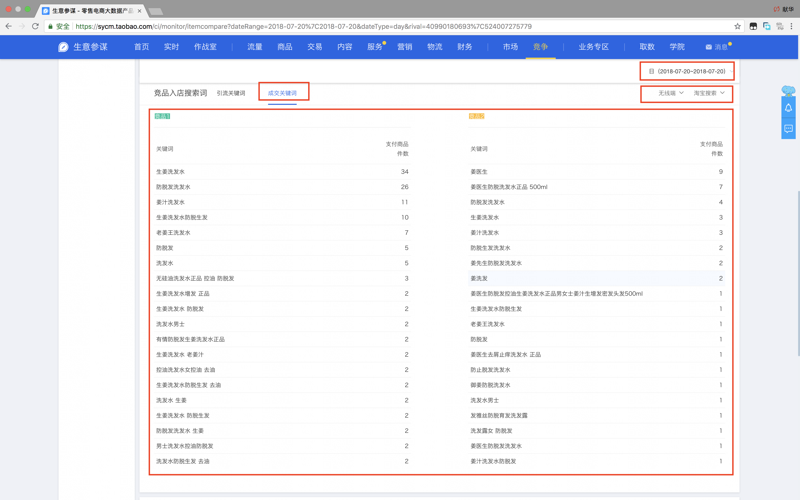
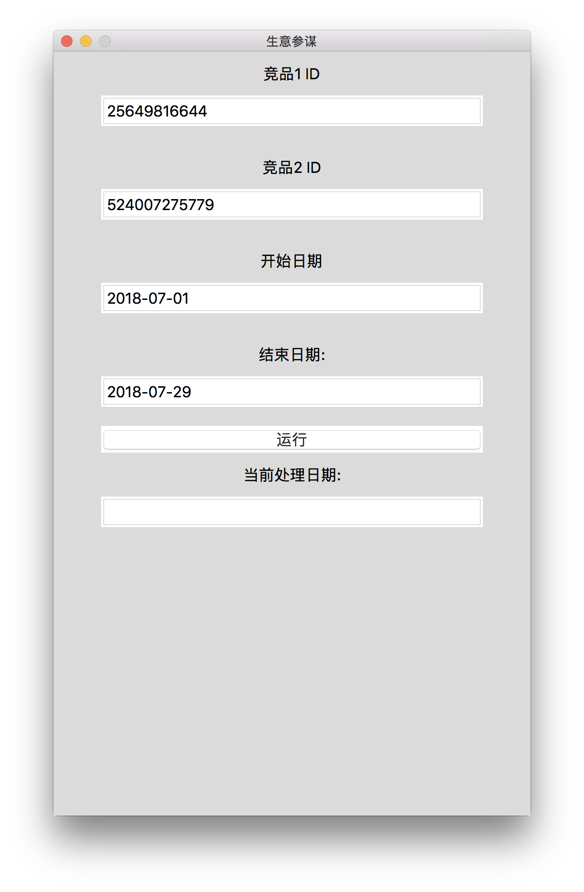
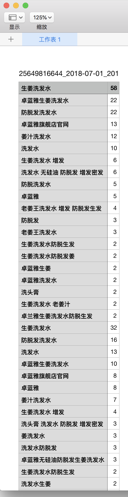

# sycm
---

生意参谋

# 需求
---

帮朋友做一个生意参谋的软件，需求如下。






1. 首先选中两个竞品
2. 再把更新时间选为日，获取每一天的数据再合并
3. 竞品入店搜索词 后面选择 **无线端**
4. 需要把 **引流关键词** 和 **成交关键词** 的数据导出 Excel

# 分析
---

第 4 点只要导出 csv 文件应该就可以了。

主要任务就是模拟一天一天的获取数据。

首先想到的解决方案是用爬虫，不过要动态获取。 X

再想要用 **selenium** 等模拟浏览器行为： 麻烦。 X

最后还是抓包再说。 O

用 **Charles** 抓取数据，对比后发现返回的是 *json* 模式数据。O O

好了，这下方便多了，分析一下 *url* 及返回数据格式。

还有一个登录的问题，我这里用最简单的，获取 **Chrome** 的 *cookie*，放到请求头中。

# 编码
---

花了 2 天时间，数据可以获取成功了，其中遇到不少坑。

比如 **引流关键词** 和 **成交关键词** 返回数据大概相同，我就用同一数据，结果问题报错。

后来才发现，里面的有一个字段不一样，郁闷。

cookie 本来想用 browsercookie 处理，后来发现不行，最后还是写到 cookie String 里面。

# GUI
---

选择官方自带的 *tkinter*。参考 <https://github.com/Dvlv/Tkinter-By-Example> 最简单的例子。

也遇到不能显示界面，又是一堆的配置问题，安装 `python` 还是用网络安装的方式最好。



编码可以了，不过人家要可以执行的软件，于是用 **pyinstaller** 生成 *exe* 文件，这才是一个天大的坑。

没有看说明文档： <http://www.pyinstaller.org/downloads.html>

```
Downloads
The latest stable release of PyInstaller is 3.3.1 (Change Log).

Release 3.3.1: stable, supports Python 2.7, 3.3–3.6

PyInstaller 3.3.1 (tar.gz) (pgp, sha-256: 715f81f24b1ef0e5fe3b3c71e7540551838e46e9de30882aa7c0a521147fd1ce)
Development: unstable, supports Python 2.7, 3.4–3.6

```

在 *Windows* 下打包总是出错，因为我下载的 **Python 3.7.0**。 cry...

# 交付
---

数据可以获取了，也有一个丑陋的界面，也可以导出数据了。

可以交付了吧，当然不行！

导出数据想要 WPS 能打开。嗯，csv 可以另存为 *xlsx*，不算问题。

数据想要合并，不要日期，不要其它说明，只要数据汇总，好，可以。



# Licence
----

`sycm` is released under the MIT license. See [LICENSE](LICENSE) for details.
